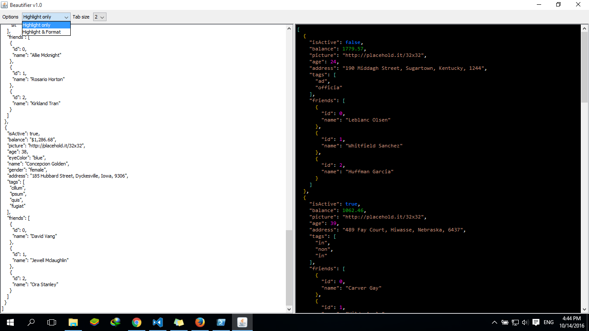

# JSON Pretty Printer


## Overview
JSON (JavaScript Object Notation) is a simple, lightweight data-interchange format. It is easy for humans to read and write. It is easy for machines to parse and generate.


JSON is built on two structures:
	* A collection of name/value pairs. In various languages, this is realized as an object, record, struct, dictionary, hash table, keyed list, or associative array.
	* An ordered list of values. In most languages, this is realized as an array, vector, list, or sequence.

Example:

```json
    {
     "name": "John",
     "age": 25,
     "address": {
       "streetAddress": "21 2nd Street",
       "city": "New York",
     },
     "phoneNumbers": [
       {
         "type": "home",
         "number": "212 555-1234"
       },
       {
         "type": "office",
         "number": "646 555-4567"
       },
       {
         "type": "mobile",
         "number": "123 456-7890"
       }
     ],
     "children": [],
    }
```

This project aims to build a Pretty Printer which colorize and format JSON texts.

## Goals

1. Make a use of Lexer, and Parser to develop syntax colorizing  & formatting for JSON with the help of ANTLR tool.
2. Familiarize the students with modern software development platforms, and tools, typically Git, and Github.
3. To provide a scenario that proves the compiler basic concepts can be used in various fields, other than creating a programming languages, including but not limited to Natural language processing(NLP), Software Development tools ..etc. In this case, Pretty Printers, which is most likely a core feature of any Text editor or IDEs.

## Specifications

The project has two main features, colorizing , and formatting given JSON texts.
Colorizing  is limited to language tokens, it’s doesn’t support advanced features for example: different colors for JSON key, and String values. Like bellow:

        “Key” : ”value”

We will treat both values above simply as String, in other words, we will color both of them with the same color.
For formatting part, we will support formatting JSON text given a variable indentation size. By formatting we mean, if a user insert text like:

	[{"key":"value","another key":true}]
Or

	[{"key":"value",
	"another key":true}]

Or any other “ugly” format, we should output:

    [
    ...{
    ........"key":"value",
    ........"another key":true
    ....}
    ]
Where dots `....` represents indentation, which may vary between 2, 4, or 8 spaces.

### Starter Code!
For the sake of simplicity and helps students to focus only on the core implementation, we will provide a starter code contains:
* Full GUI Components, only events are missing.
* JSON grammar file to be used with ANTLR.

Students will only focus on getting colorizing and formating work :)

### Team Size
2 students


### Platform

All teams must use Github to host their source code.

## Milestones
The project is divided into two milestones, at the end of which, a major functionality is delivered.
Each milestone will has start date and end date, and will be graded independently from each others. In addition, at the end of each milestone, in the same day, a working solution code will be pushed to pre-known Github repository, helping students to figure out their mistakes.

Note: students are free to use the solution code for the next milestone.

 * **Support JSON Colorizing (duration 4 days)**
 
By the end of this milestone, the tool should be able to colorize the following JSON tokens:
  1. Numbers: Use different colors for integer numbers & float numbers
  1. Strings
  2. Keyword values: `true`, `false`, `null`
  3. Curly Brackets: `{` & `}`
  4. Square Braces: `[` & `]`


**Note:** colors values are team defined, which means, they don’t necessary be the 
same for all teams, but however there should noticeable different Tokens’ colors.

* **Support JSON Formatting (duration 3 days)**

By the end of this milestone, the tool should be able to format any given json text 
outputting a readable result using the following rules:
1. For objects

       	{
        	“Key” : value,
            “Key” : value,
            …. And so on
		}
2. For empty objects

   Simply output: `{}` in the same line.
3. For arrays

        [
        	Value1,
            Value2,
            ...
		]
4. For empty arrays
   
   Simply output: `[]` in the same line.


## Final delivery 

The final product must be something like this:
  
[](src/examples/json.png)


….
Best wishes